# F4 — Duyệt rule module viết đè component chung (17/09/2026)

Bước 1 (chưa sửa code). HEAD `584e3aa`, DB `wujia_f0` port 8099, tài khoản `anh.owner` + `em.hcm`.

## 0. Cách đo

- **Đếm:** `scripts/qa/css_owner.py --overrides` ⇒ **44 rule đổi dáng** (F0: 41). Lệch +3 = ba rule
  vỏ `:not(.wj-data-item)` do F2/F3 dời xuống module: `portal_dashboard.css:266` (base),
  `portal_knowledge.css:84`, `portal_history.css:15`. Số "chỉ bố cục" không đổi.
- **Tắt từng rule trong trình duyệt** (`scratchpad/f4/ablate.py`): mở màn có component, tìm đúng
  rule trong CSSOM, ghi computed style các thuộc tính rule khai trên mọi phần tử đích, `deleteRule`,
  đo lại, chụp ảnh trước/sau. Chạy 2 tài khoản × khổ màn của rule (390 cho rule mobile, 1440 cho PC).
  ⇒ Biết chắc rule **chết** (0 phần tử khớp / 0 khác) hay **sống** và bỏ đi thì đổi đúng cái gì.
- **Ảnh** ở `docs/f4-img/<id>.png`: trái/trên = hiện tại, phải/dưới = bỏ rule (dáng component).
- Tra dấu vết: `qa-issue-ledger.yaml`, `*acceptance-matrix.md`, comment tại chỗ.

## 1. Tóm tắt

| Loại | Số rule | Đổi giao diện? | Việc bước 2 |
|---|---|---|---|
| **(b0)** chết / trùng component | 13 (+1 rule layout của F2) | Không | Xoá |
| **(a)** thành biến thể/sửa component | 9 | Không ở màn đè (2 mục đổi nhẹ màn khác, ghi rõ) | Thêm ở layout, xoá rule module |
| **(b)** lệch vô lý → về chuẩn | 14 | **Có — báo BA** | Xoá rule |
| **(c)** giữ, có ghi chú | 8 | Không | Thêm comment `F4(c)` tại chỗ |

Tổng 13 + 9 + 14 + 8 = **44**. Sau bước 2 `css_owner --overrides` chỉ còn 8 rule (c) + "chỉ bố cục".

## 2. (b0) Rule chết / trùng — xoá, 0 đổi giao diện

| id | Rule | Bằng chứng |
|---|---|---|
| debt215 | `portal_debt.css:215` `.wj-debt-inv:not(.wj-data-item)` | Call site duy nhất `portal_debt.xml:237` đã mang `wj-data-item` ⇒ 0 phần tử khớp (đo 2 TK) |
| debt284 | `portal_debt.css:284` `.wj-debt-pay:not(.wj-data-item)` | `portal_debt.xml:545` có `wj-data-item` · 0 khớp |
| dlv49 | `portal_delivery.css:49` `.wujia-mdelivery-row:not(.wj-data-item)` | 2 call site đều có `wj-data-item` · 0 khớp |
| exam169 | `portal_exam.css:169` `.wujia-mexam-course:not(.wj-data-item)` | `portal_exam.xml:673` · 0 khớp |
| exam574 | `portal_exam.css:574` `.wujia-mexam-rrow:not(.wj-data-item)` | `portal_exam.xml:1123` · 0 khớp |
| know84 | `portal_knowledge.css:84` `.wujia-mknow-row:not(.wj-data-item)` | `portal_knowledge.xml:228` · 0 khớp |
| noti46 | `portal_notification.css:46` `.wujia-mnoti-row:not(.wj-data-item)` | `portal_notification.xml:138` · 0 khớp |
| hist15 | `portal_history.css:15` `.wujia-mhist-row:not(.wj-data-item)` | `portal_history.xml:121` · 0 khớp |
| ret33 | `portal_return.css:33` `.wujia-mreturn-row:not(.wj-data-item)` | `portal_return_list.xml:235` · 0 khớp |
| dlv183 | `portal_delivery.css:183` `.wujia-dlv-pc .wj-pc-page-header__title` (+ dòng `__crumb` kề) | Màn Giao hàng PC đã dùng `wj_page_header` (không còn class `wj-pc-page-header__*`) · 0 khớp ở `/portal/delivery` + `/delivery/1` |
| exam705 | `portal_exam.css:705` `.wj-exam-pc .wj-pc-card__title` | Không view nào của exam còn `wj-pc-card__title` · 0 khớp ở 3 màn Thi PC |
| exam1318 | `portal_exam.css:1318` `.wj-exam-pc-tablebox … tr:last-child td{border-bottom:0}` | Trùng rule component `_pc_components.css:193` · 1 khớp, 0 khác |
| sale855 | `portal_order.css:855` 6 selector `:focus-visible{outline:2px solid cta; offset 2px}` (WJ-ORD-019) | Vòng focus chung `_interaction.css` §2 = `var(--wujia-focus-ring)` = **cùng giá trị** (`_variables.css:27`) và đặc hiệu (0,3,1) > (0,2,0)/(0,3,0) ⇒ rule module không bao giờ thắng. WJ-ORD-019 vẫn đạt nhờ rule chung; bước 2 đo ép `:focus-visible` để chốt |
| **lay1328** (F2 để lại) | `_components.css:1329` `.wujia-mknow-article > .wj-card-header{margin-top:16px}` | 1 khớp, 0 khác — thua `--compact{margin:0 0 8px}` như F2 ghi |

Guard D5 (`test_d5_data_list.py`) kiểm "rule vỏ cũ phải mang `:not(.wj-data-item)`" — xoá hẳn rule thì guard vẫn xanh
(không còn rule để kiểm); bước 2 chạy lại để chắc.

## 3. (a) Thành biến thể / sửa component — 0 đổi ở màn đè

| id | Rule hiện tại | Bỏ rule thì đổi | Đề xuất ở layout | Màn cần | Ảnh |
|---|---|---|---|---|---|
| noti108 · noti109 | `.wujia-mnoti-row-tags .wujia-badge{11px; 3px 8px}` · `… .wujia-badge i{11px}` | badge 11→12px, đệm 3/8→4/10, cao 23.4→26.8 | **`wujia-badge--sm`** (11px · 3px 8px · icon 11px) | TB mobile list + chi tiết | 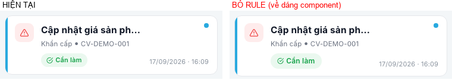 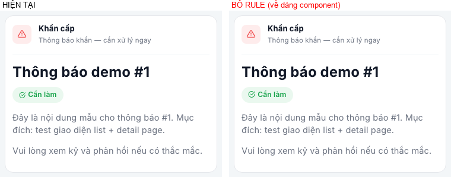 |
| noti412 | `.wj-pc-noti-popup__item-tags .wj-pc-badge{auto;3px 8px;11px/600/1.35}` | badge popup cao 20.8→28, chữ 11→13 | **`wj-pc-badge--sm`** cùng số | Popup chuông (mọi trang PC) | 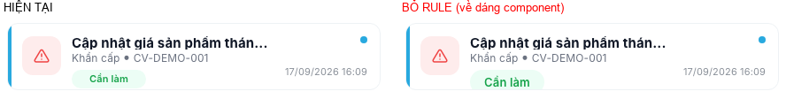 |
| exam727 | `.wj-exam-pc .wj-pc-table thead th{14px !important}` | 14→**16px** — `style.css` Vuexy `table th{16px !important}` nuốt component | Component `.wj-pc-table thead th` thêm `!important` (đúng số 14 đã khai) | Thi PC; **bảng `wj-pc-table` khác đang bị 16px sẽ về 14** — bước 2 đo, có thì báo BA | 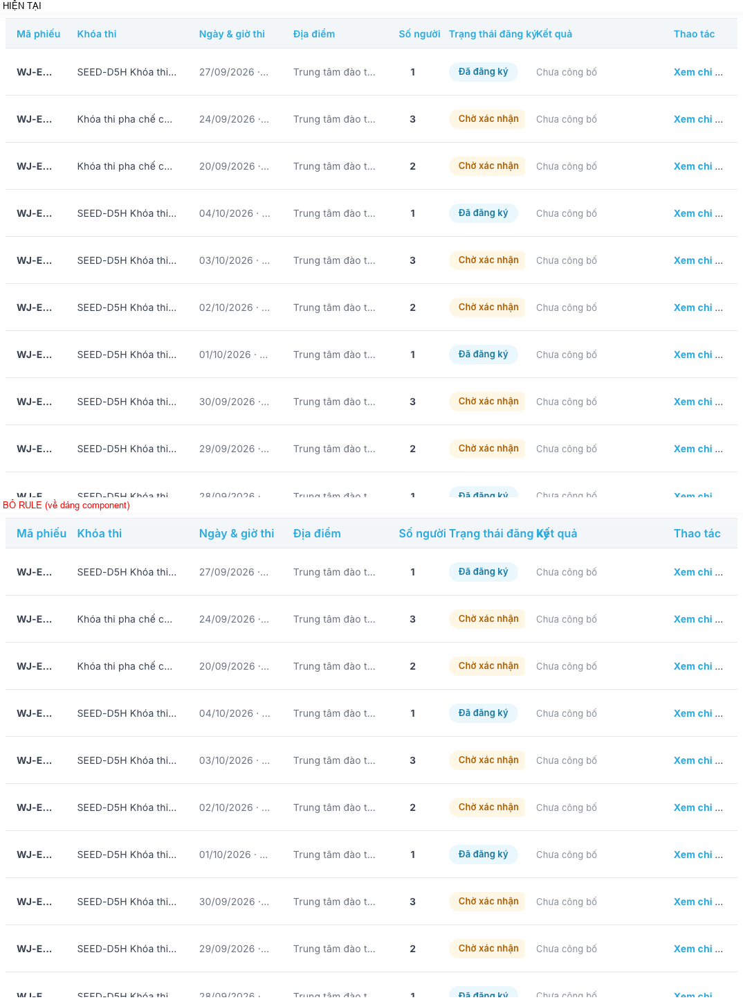 |
| exam687 | `.wj-exam-pc .wj-pc-page-header__title{30px;800 !important}` | 800→**700** — `.content-wrapper h1{700 !important}` (0,1,1) thắng component (0,1,0) | Nâng đặc hiệu component `.wj-pc-page-header .wj-pc-page-header__title` | Thi PC (2 màn còn header viết tay) + gallery | 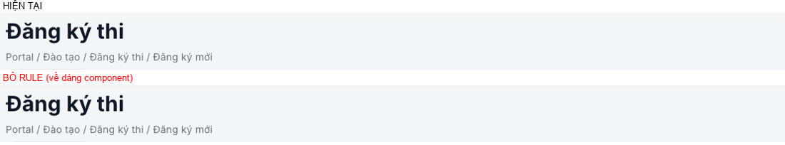 |
| dlv46 (phần màu) | `.wj-data-list--detail-card .wujia-mdelivery-row.wj-data-item{…color:inherit}` | chữ hàng thành màu link `#243742` | Thêm `color:inherit` vào `.wj-data-list--detail-card a.wj-data-item` (compact-row đã có ở họ mdash); phần flex/gap giữ ở module | Giao hàng, Đổi trả (hàng `<a>`) — đo Đổi trả bước 2 | 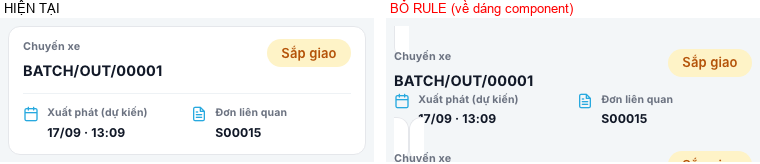 |
| sale686 | `.wj-pc-order-filter select.wj-pc-filter-control{cursor:pointer}` (+ padding bố cục) | con trỏ select về mũi tên | Component `select.wj-pc-filter-control{cursor:pointer}` | Đặt hàng; **select lọc PC ở màn khác cũng thành bàn tay** (chỉ con trỏ) | 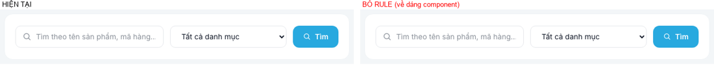 |
| debt721 · debt346 | Nhãn "CÒN PHẢI TRẢ" (CardHeader) + "THÔNG TIN CHUYỂN KHOẢN" (SectionHeader): 11px · 700 · .02em · màu phụ | nhãn thành tiêu đề 16px / **20px** đen, thẻ bank cao cố định 150px bị tràn | **`wj-card-header--eyebrow`** (11/700/.02em/1.5, màu subtitle); đổi call site bank từ SectionHeader → CardHeader eyebrow (câu hỏi treo trong comment "tiêu đề thẻ hay khối": nằm trong thẻ ⇒ thẻ) | Công nợ (tổng) + Thanh toán (2 màn) | 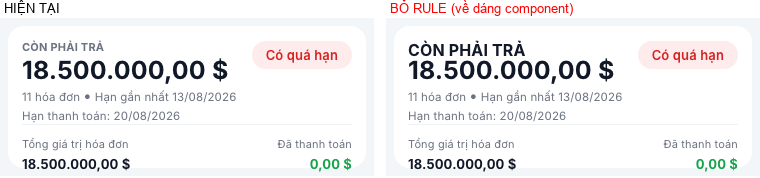 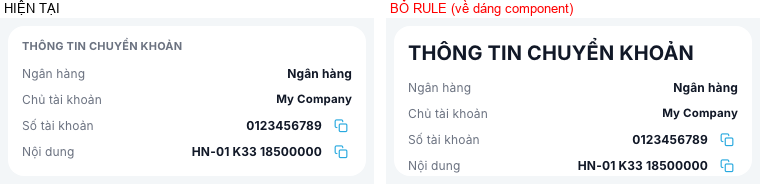 |

## 4. (b) Lệch vô lý → về dáng chuẩn — **CÓ đổi giao diện, báo BA**

| id | Rule | Hiện tại → chuẩn | Dấu vết | Ảnh |
|---|---|---|---|---|
| exam693 | `.wj-exam-pc .wj-pc-page-header__crumb` | breadcrumb 400 → **500** | Không issue; mọi màn PC khác 500 | 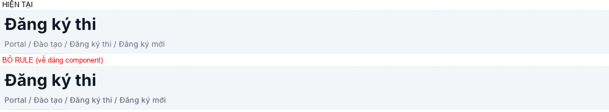 |
| exam694 | `.wj-exam-pc .wj-pc-btn` | nút 700 → **600** | Không issue | 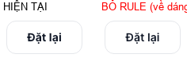 |
| exam774 | `.wj-exam-pc-list-table .wj-pc-td--code` | mã 700 → **600** | Không issue (D5c cố ý để biến thể ô cho module — nhưng chỉ exam lệch) | 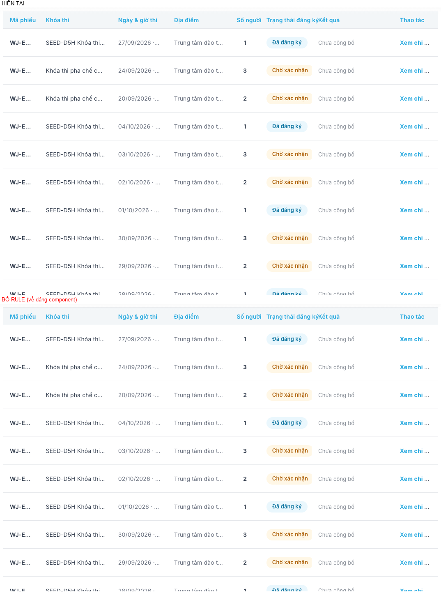 |
| exam775 · exam855 · exam1338 · exam1658 | `… .wj-pc-td--muted{font-weight:400}` × 4 bảng | chữ phụ 400 → **500** | Không issue; công nợ/giao hàng/lịch sử/thông báo đều 500 | 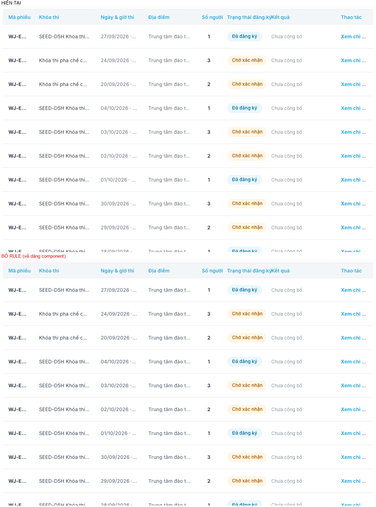 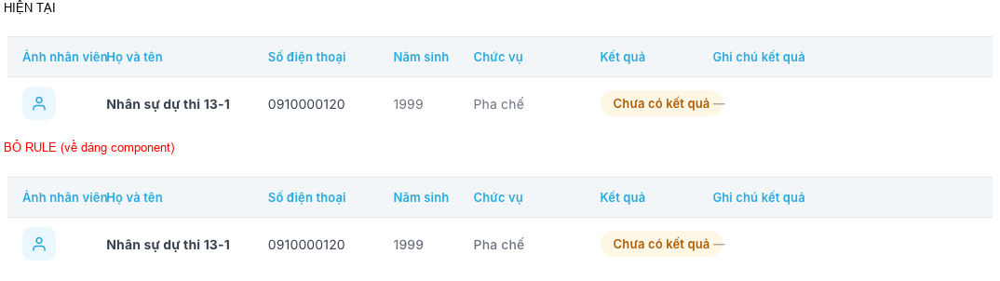 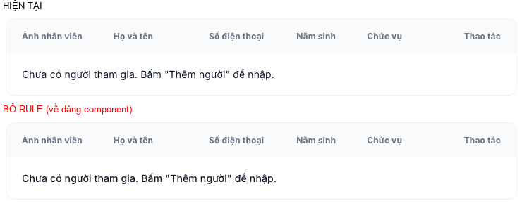 |
| noti28 | `.wujia-mnoti .wj-filter-chip{12px}` | chip 12 → **11.3px** (rộng −2..−3px) | Comment Figma 4651:655; chip mọi màn mobile khác 11.3 (đã reconcile Figma) | 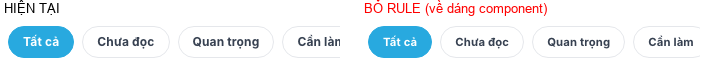 |
| debt246–249 | `.wj-debt-empty .wj-empty-state-*` | icon 68→**64**, glyph 27→**28**, tiêu đề 19→**18**, dòng phụ 12.5→**14**px | Comment "359×224" Figma; không issue. Ảnh dựng bằng markup đúng template (DB không có tuần rỗng) | 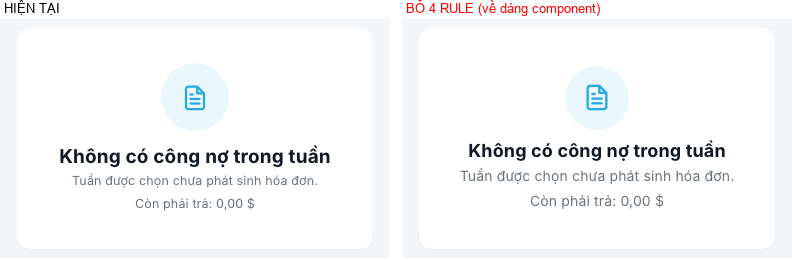 |
| sale925 | `.wj-empty-state.wujia-mcart-empty-card .wj-empty-state-title{20px}` | tiêu đề giỏ trống 20 → **18px** | Comment Figma 5028:755; không issue | 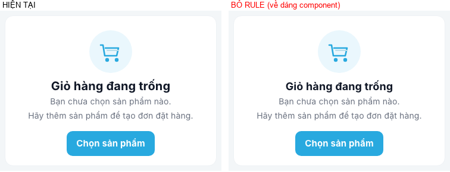 |
| ret134 | `….wj-return-sublabel .wj-card-header__title{color:rgba(0,0,0,.7) !important}` | nhãn phụ xám .7 → **#111827** như Khảo sát (cùng modifier `--sublabel`) | D3e/D6b: modifier đã gánh cỡ chữ, màu ở lại module | 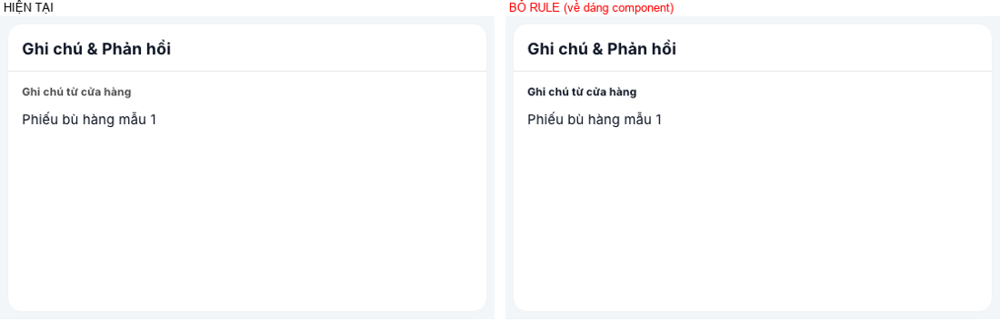 |

## 5. (c) Giữ — ghi chú tại chỗ

| id | Rule | Vì sao giữ |
|---|---|---|
| rep88 | `.wj-rep-pcmetrics .wj-pc-metric-card__value{24px}` | **Đã duyệt**: D4e1 + ledger dòng 1639 "CỐ Ý GIỮ" (4 thẻ trong cột 1136px, 30px tràn). 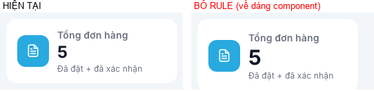 |
| exam720 | `sechead--sm/--2/slots__head` title 16/22 | **Chủ dự án chốt 04/09/2026** (RULE 1 phân cấp khối con). Khi màn thứ 2 cần ⇒ nâng thành `wj-card-header--nested`. 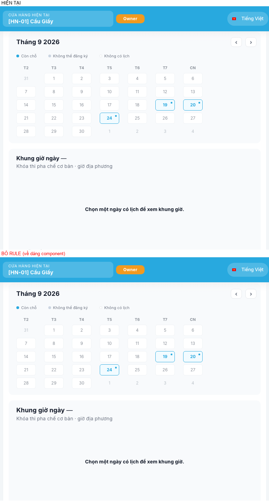 |
| debt707 | `.wj-debt-hint … title{11.5px; warn-strong}` | Ngoại lệ màu `--wj-debt-warn-strong` đã ghi đầu `portal_debt.css:8` (Figma S43, hộp cao 52px). 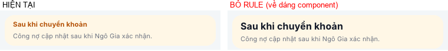 |
| ret137 | `.wj-return-sublabel--danger` title màu danger | Màu ngữ nghĩa "Lý do từ chối", 1 màn; DB không có phiếu bị từ chối để chụp |
| base266 | `.wujia-mhome .wujia-mdash-row-title.is-sm` clamp 2 dòng | Hành vi cắt chữ của Home (7 dòng), không đổi cỡ/màu. 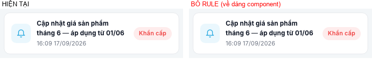 |
| noti252 | `.wj-data-table.wj-pc-noti-table tbody tr:hover{rgba .04}` | Trả lại **đúng** hover component bị zebra của chính module nuốt (D5c) — giá trị = component. 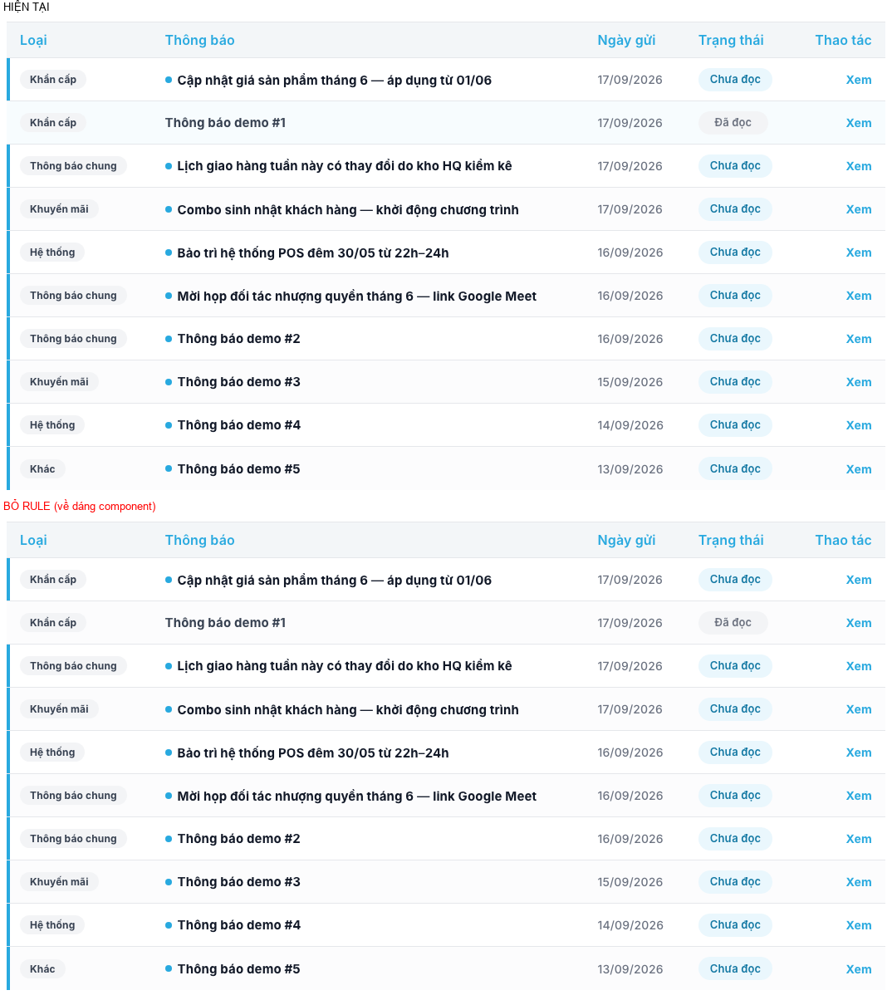 |
| exam1316 | `.wj-exam-pc-tablebox … th:first/last-child{radius:0}` | Bảng nằm trong hộp có viền + `overflow:hidden`; bo 12px đầu bảng thành góc lõm. 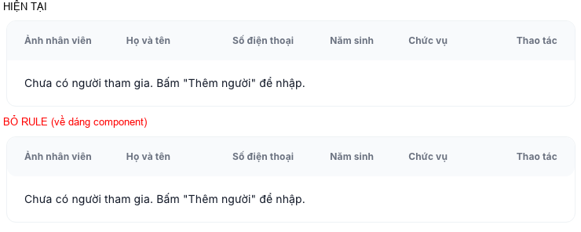 |
| sale918 | `.wj-empty-state-icon.wujia-mcart-empty-icon` 72px + SVG giỏ hàng | Là **nội dung** (hình minh hoạ giỏ, Figma 5028:747), không phải dáng. 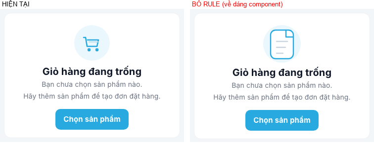 |

## 6. Hai món F2/F3 để lại

### 6.1 `:is()` ở `_interaction.css` liệt kê tên màn

Hiện tại 3 danh sách (transition ~61, hover ~87, active ~110) × 33 bộ chọn, **20 là tên màn**; gạch chân ~24
có `.wujia-mknow-body`, `.wujia-mticket-bubble` (nội dung người dùng nhập — giữ, đó là vùng chữ, không phải component).
Đặc hiệu cả khối = (0,3,0) do `.wj-inspection-pc .wj-pc-page-btn:not(.is-active):not(.is-disabled)` (code anh Thái)
⇒ `:hover` (0,4,0) thắng mọi hover của component.

**Hai màu hover đang cùng tồn tại (đo 991/1440):**

| Bề mặt | Hover đang có | Ảnh |
|---|---|---|
| Hàng mobile compact-row trong `:is()` (mnoti/mhist/mknow/mdash) | `#EAF7FD` (primary-soft) + viền primary + shadow | 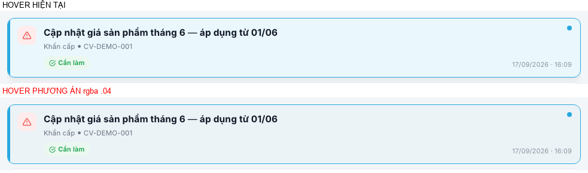 phải = nếu dùng rgba .04: **thẻ trắng thành trong suốt, lộ nền xám trang** |
| `wj-debt-inv` (`
` không bấm được) | rgba .04 + viền primary (rule compact-row) — D5g đã nêu "gợi ý sai khả năng bấm" | 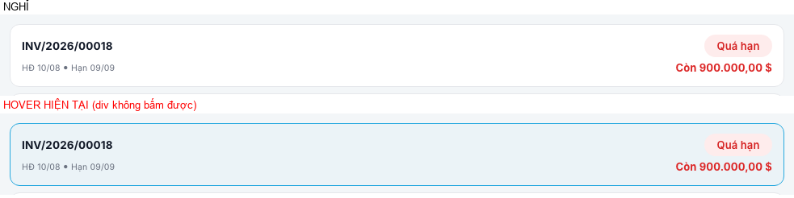 |
| Hàng inset Home PC (`li.wujia-content-card-row`) | chỉ link đổi màu | 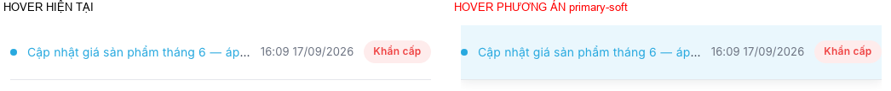 |
| Dòng bảng PC (`wj-data-table`) | rgba .04 (hợp lý: dòng nằm trong nền trắng của bảng) | 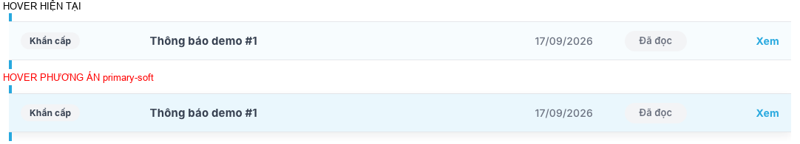 |

**Đề xuất:**
1. **Một màu hover cho bề mặt thẻ/hàng bấm được = primary-soft + viền primary + shadow** (đang là dáng người dùng thấy
   ở 4 họ mobile). Rule `.wj-data-list--compact-row .wj-data-item:hover` đổi sang `a.wj-data-item` + cùng token ⇒
   `wj-debt-inv` (div) **mất hover** (đóng câu hỏi D5g). Dòng bảng PC giữ rgba .04 (khác loại bề mặt: dòng trong bảng).
2. Danh sách `:is()` theo **component**: `a.wj-data-item` (thay 6 họ hàng mdash/mdelivery/mhist/mknow/mnoti/mreturn),
   giữ các class component của layout (`wj-filter-chip`, `wj-filter-search-btn`, `wj-pc-btn--secondary`,
   `wj-page-header__back`, `page-link`, `wj-pc-acct-nav__item`, `wj-pc-acct-eye`, `wujia-maccount-eye`).
3. Bề mặt riêng màn chưa có component (14: `wujia-mhome-kpi/-action`, `wujia-kpi-card-link`, `wujia-store-mobile-strip--clickable`,
   `wujia-mdash-card`, `wujia-mexam-card`, `wujia-mknow-feat`, `wj-debt-actionrow`, `wj-debt-pc-tab`, `wj-debt-pc-pdf`, `wj-pc-dlv-chip`,
   `wujia-mreturn-btn-cancel`, `wj-exam-pc-navbtn`, + nhóm bước/xoá giỏ `wj-pc-cart-step/del`, `wujia-mcart-step/del`,
   `wujia-morder-mstep`, `wujia-morder-row-add`, `wujia-morder-search-btn`) ⇒ **thêm class đánh dấu `wj-state-surface`**
   vào XML của chính module, `:is()` chỉ còn tên đó. 10 class sale/base F3 giữ lại đi đường này.
4. Tách `.wj-inspection-pc .wj-pc-page-btn…` ra **rule riêng** (không sửa class Khảo sát) ⇒ `:is()` hết bị kéo lên (0,3,0).
   Đặc hiệu mới phải ≥ hover component đang thua nó — bước 2 đo bằng cstyle ép `:hover`/`:active`, lệch thì thêm `:where()`/
   nâng có chủ đích, không suy luận.

Đổi giao diện theo đề xuất: `wj-debt-inv` mất nền hover; phần còn lại **0 khác** (mục tiêu đo).

### 6.2 `.wujia-mknow-article > .wj-card-header{margin-top:16px}` ⇒ (b0) ở §2 (lay1328).

## 7. Cần chủ dự án duyệt

1. Bảng (b) §4 — 14 rule về chuẩn, đổi giao diện nhẹ ở Thi PC, Thông báo mobile, Công nợ/Giỏ trống, Đổi trả.
2. Màu hover §6.1 (primary-soft cho thẻ/hàng bấm được; `wj-debt-inv` mất hover).
3. Class đánh dấu `wj-state-surface` §6.1-3 (đụng XML 7 module của mình) hay giữ tên màn trong `:is()` và chỉ thay 6 họ hàng bằng `a.wj-data-item`.
4. (a) eyebrow: đổi call site "THÔNG TIN CHUYỂN KHOẢN" SectionHeader → CardHeader.

## 8. Bước 2 — đã áp (17/09/2026, chủ dự án duyệt: (b) theo đề xuất, hover primary-soft, dọn toàn bộ `:is()`, eyebrow)

**Đã làm**
- Xoá 13 (b0) + `lay1328`, 14 (b). Thêm biến thể layout: `wujia-badge--sm` (+ `.wujia-badge i{11px}`), `wj-pc-badge--sm`,
  `wj-card-header--eyebrow` (0,4,0). Sửa component: `.wj-pc-page-header .wj-pc-page-header__title{800 !important}`,
  `select.wj-pc-filter-control{cursor:pointer}`, `.wj-data-list--detail-card a.wj-data-item{color:inherit}`.
- Công nợ: tổng "CÒN PHẢI TRẢ" thêm `--eyebrow`; "THÔNG TIN CHUYỂN KHOẢN" đổi SectionHeader → CardHeader `--eyebrow`.
- `_interaction.css`: 3 danh sách `:is(a.wj-data-item, .wj-state-surface:not(.is-active), 8 class component):not(.is-disabled)`
  (đặc hiệu giữ (0,3,0)/(0,4,0)); nhóm Khảo sát tách rule riêng; gạch chân dùng marker `wj-richtext`.
  Marker `wj-state-surface` gắn ở XML 12 module của mình (thẻ KPI/nút Home, mdash-card/row, tab/chip/nút giỏ…).
  Bỏ rule hover rgba .04 `.wj-data-list--compact-row .wj-data-item:hover`.
- (c) thêm comment `F4(c)` tại chỗ. **exam727 đổi (a) → (c) nợ FR-B**: đo mốc thấy Vuexy `table th{16px !important}` đang
  thắng ở MỌI bảng PC (Home, Công nợ, Giao hàng, Thông báo, Lịch sử, Đổi trả, Khảo sát — 16px); sửa component là đổi 8 màn,
  ngoài phạm vi đã duyệt.

**Đo** (cstyle 2 lượt mốc: A 0 khác ngoài nhiễu 0.36px một dòng Kiến thức; B 0 khác · sau sửa so với mốc, class marker chuẩn hoá khỏi khoá)
| Khác đo được | Màn | Thuộc bảng |
|---|---|---|
| chip 12→11.3px | Thông báo mobile | (b) noti28 |
| nút `wj-pc-btn` 700→600, td--code 700→600, td--muted 400→500, crumb 400→500 | Thi PC | (b) exam693/694/774/775/855/1338/1658 |
| tiêu đề giỏ trống 20→18px | Giỏ mobile/PC | (b) sale925 |
| nhãn phụ `.7 đen` → #111827 | Đổi trả chi tiết | (b) ret134 |
| tiêu đề trang PC 700→800 | Thi PC (header viết tay) + **Khảo sát PC** | (a) exam687 — sửa component nên Khảo sát cũng đúng số 800 |
| con trỏ select lọc → bàn tay | Giao hàng, Thông báo, Thi PC | (a) sale686 |
| chữ thừa kế trong hàng `<a>` #243742 → #111827 | Đổi trả + thẻ Thi mobile (Giao hàng PC là DOM ẩn) | (a) dlv46 — đã báo trước "đo Đổi trả bước 2" |
| nhãn "THÔNG TIN CHUYỂN KHOẢN" cao 14→16.5px (line-height normal→1.5); thẻ vẫn 150px | Công nợ /pay | (a) eyebrow |
| hover: `wj-debt-inv` + `wujia-mexam-rrow` (đều `
` không bấm được) mất nền/viền hover | Công nợ, chi tiết phiếu thi | §6.1 đã duyệt |
| badge hàng thông báo, icon badge, "CÒN PHẢI TRẢ", popup chuông | — | 0 khác (DOM ẩn ở 1440 đổi theo đúng dáng mobile) |

Hover/active ép trên **mọi** phần tử ứng viên (không chỉ 6 đầu): 0 phần tử mất/thừa hover; lệch `:active` còn lại là
màu giữa transition (chụp lúc chuyển). `css_owner --overrides`: **44 → 9 đổi dáng**, cả 9 là (c) có comment. B4 286/286.
